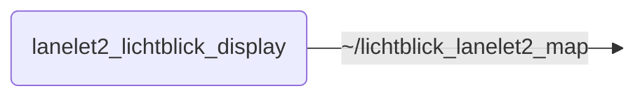

# `lanelet2_lichtblick_display`

Converts Lanelet2 maps to MarkerArrays for visualization in Lichtblick

## Nodes

### `lanelet2_lichtblick_display`

#### Published Topics

| Topic | Type | Description |
| --- | --- | --- |
| `~/lichtblick_lanelet2_map` | `visualization_msgs/msg/MarkerArray` | TODO |

#### Parameters

| Parameter | Type | Default | Description |
| --- | --- | --- | --- |
| `left_bound_line_width` | `float` | `0.1` | Width of the left boundary lines |
| `left_bound_color_hex` | `string` | `"#0000FF"` | Color of the left boundary lines |
| `left_bound_line_opacity` | `float` | `0.5` | Opacity of the left boundary lines |
| `right_bound_line_width` | `float` | `0.1` | Width of the right boundary lines |
| `right_bound_color_hex` | `string` | `"#FF0000"` | Color of the right boundary lines |
| `right_bound_line_opacity` | `float` | `0.5` | Opacity of the right boundary lines |
| `centerline_line_width` | `float` | `0.08` | Width of the centerlines |
| `centerline_color_hex` | `string` | `"#008000"` | Color of the centerlines |
| `centerline_line_opacity` | `float` | `0.4` | Opacity of the centerlines |
| `lanelet_text_scale` | `float` | `0.5` | Scale of the lanelet ID text |
| `lanelet_text_color` | `string` | `"#000000"` | Color of the lanelet ID text |
| `lanelet_text_opacity` | `float` | `1.0` | Opacity of the lanelet ID text |
| `reference_line_width` | `float` | `0.2` | Width of the reference lines |
| `reference_line_color_hex` | `string` | `"#FFFF00"` | Color of the reference lines |
| `reference_line_opacity` | `float` | `0.5` | Opacity of the reference lines |
| `traffic_light_mesh_resource` | `string` | `TODO` | Link to the traffic light model to use |
| `traffic_light_scale` | `float` | `1.0` | Scale of the traffic lights models |
| `traffic_light_z_offset` | `float` | `1.3` | Offset in z-direction of the traffic lights models (depends on model and scale) |
| `traffic_light_opacity` | `float` | `1.0` | Opacity of the traffic lights |
| `yield_sign_mesh_resource` | `string` | `TODO` | Link to the yield sign model to use |
| `yield_sign_scale` | `float` | `1.0` | Scale of the yield sign models |
| `yield_sign_z_offset` | `float` | `0.0` | Offset in z-direction of the yield sign models (depends on model and scale) |
| `yield_sign_opacity` | `float` | `1.0` | Opacity of the yield signs |

## Launch Files

### [`lanelet2_lichtblick_display_launch.py`](launch/lanelet2_lichtblick_display_launch.py)

| Argument | Default | Description |
| --- | --- | --- |
| `output_topic` | `"~/lichtblick_lanelet2_map"` | TODO |
| `name` | `"lanelet2_lichtblick_display"` | TODO |
| `namespace` | `""` | TODO |
| `params` | `os.path.join(get_package_share_directory("lanelet2_lichtblick_display"), "config", "params.yml")` | TODO |
| `log_level` | `"info"` | TODO |
| `use_sim_time` | `"false"` | TODO |
