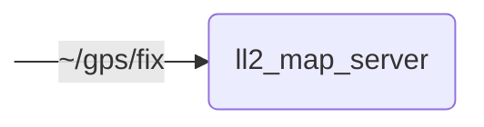

# `lanelet2_map_server`

Provides Lanelet2 maps to other modules

## Nodes

### `ll2_map_server`

#### Subscribed Topics

| Topic | Type | Description |
| --- | --- | --- |
| `~/gps/fix` | `sensor_msgs/msg/NavSatFix` | position for map auto-loading |

#### Parameters

| Parameter | Type | Default | Description |
| --- | --- | --- | --- |
| `map_frame_id` | `string` | `"map"` | Frame ID of Lanelet2 map |
| `use_automatic_map_selection` | `bool` | `true` | Automatic map selection |
| `map_directory` | `string` | `"/data/maps/default-maps"` | Directory containing Lanelet2 maps |
| `map_filepath` | `string` | - | Path to Lanelet2 map |
| `origin_lat` | `float` | - | Latitude of origin of Lanelet2 map |
| `origin_lon` | `float` | - | Longitude of origin of Lanelet2 map |
| `map_contents` | `string` | - | Contents of Lanelet2 map |

## Launch Files

### [`lanelet2_map_server_launch.py`](launch/lanelet2_map_server_launch.py)

| Argument | Default | Description |
| --- | --- | --- |
| `nav_sat_fix_topic` | `"~/gps/fix"` | NavSatFix topic for map auto-loading |
| `name` | `"lanelet2_map_server"` | node name |
| `namespace` | `""` | node namespace |
| `params` | `os.path.join(get_package_share_directory("lanelet2_map_server"), "config", "params.yml")` | path to parameter file |
| `log_level` | `"info"` | ROS logging level (debug, info, warn, error, fatal) |
| `use_sim_time` | `"false"` | use simulation clock |
