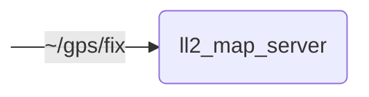

# `lanelet2_map_server`

Provides Lanelet2 maps to other modules

## Nodes

### `ll2_map_server`

#### Subscribed Topics

| Topic | Type | Description |
| --- | --- | --- |
| `~/gps/fix` | `sensor_msgs/msg/NavSatFix` | TODO |

#### Parameters

| Parameter | Type | Default | Description |
| --- | --- | --- | --- |
| `map_frame_id` | `string` | `"map"` | Frame ID of Lanelet2 map |
| `use_automatic_map_selection` | `bool` | `true` | Automatic map selection |
| `map_directory` | `string` | `"/data/maps/default-maps"` | Directory containing Lanelet2 maps |
| `map_filepath` | `string` | `TODO` | Path to Lanelet2 map |
| `origin_lat` | `float` | `TODO` | Latitude of origin of Lanelet2 map |
| `origin_lon` | `float` | `TODO` | Longitude of origin of Lanelet2 map |
| `map_contents` | `string` | `TODO` | Contents of Lanelet2 map |
